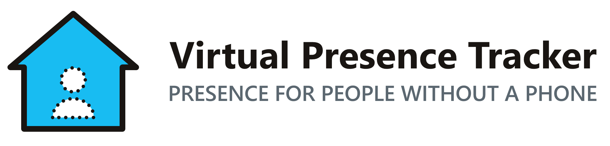

<div align="center">

<picture>
  <source media="(prefers-color-scheme: dark)" srcset="custom_components/virtual_presence_tracker/brand/dark_logo@2x.png">
  
</picture>

**Somebody is at home but Home Assistant thinks the house is empty? Tell it. For a
child without a phone, grandparents, a babysitter, or any guest.**

[![Release][release-badge]][release-url] &nbsp; [![HACS][hacs-badge]][hacs-url] &nbsp; [![Validate][validate-badge]][validate-url] &nbsp; [![Tests][tests-badge]][tests-url]

</div>

A Home Assistant custom integration. For every person who cannot be tracked
automatically you create a **virtual tracker**. While it is switched on, that
person counts as being at home: `zone.home` counts them, and the "nobody home"
automations you already have stay quiet. It switches itself off when you come
back, and it can ask you on your phone whether somebody is home when the last of
you leaves.

**This is not a presence simulation.** Unlike "Home Alone"-style integrations that
fake activity while the house is empty, this one is about people who really are at
home but carry no tracked device.

## Who it is for

Home Assistant works out who is at home from trackers, usually phones. That
breaks down whenever somebody is in the house without one: you leave, the house
looks empty, and the routines for an empty house run — lights off, alarm armed,
heating turned down, the robot vacuum sent off — around the person who is still
there.

| Somebody who… | Without a virtual tracker | With one |
|---|---|---|
| **A child** with no phone, home alone after school | The house counts as empty as soon as the last of you has left. | Their tracker is on (or they are asked on your phone): the house does not count as empty. |
| **A babysitter** for an evening | The moment you go out, your "nobody home" routines run around the sitter. | The sitter's tracker is on while you are out, and it switches itself off when you are back. |
| **Grandparents** or **guests** who stay a few days | Every time the family goes out, the empty-house routines run — for the whole visit. | Their tracker is on for the stay and off when they leave. |
| **A carer, a cleaner, a house sitter** | The house looks empty while they work. | A tracker per person, or one shared tracker, switched on when they arrive. |

Nothing has to be installed on the other person's side, and nothing is tracked:
the integration only knows what you, an automation, or an answered prompt tell it.

## How it works

1. You create a virtual tracker, for example "Grandma", and assign its
   `device_tracker` to a `person` without a login.
2. You switch it on — from a dashboard, an NFC tag, a button, an automation, or
   by answering a prompt on your phone. `person.grandma` is now `home`.
3. `zone.home` counts them, so every automation and dashboard card that asks "is
   anybody home?" sees somebody at home. When you come back to the house, the
   tracker switches itself off again (you can turn that off per tracker).

## What it does

- A **switch** per virtual tracker: on means "this person is at home".
- A **device tracker** per virtual tracker that follows the switch (`home` /
  `not_home`). This is the entity you assign to a person.
- A **binary sensor** "Only virtual trackers home" for the household: on when at
  least one virtual tracker is at home and none of your real persons is.
- **Automatic reset**: when the first real person comes back to an empty house,
  the trackers switch off again, so nobody stays "at home" for days by mistake.
- An optional **prompt** when the last real person leaves: "is Kid at home?",
  sent to the phones of the people you pick as a **notification with Yes and No
  buttons**. Every prompt is also announced by an **event entity** and can be
  answered with the action **Answer prompt**, so any other channel — a speaker,
  a dashboard, Telegram — can carry the question instead. The action **Open
  prompt** asks the question on demand, which is also how you try the whole
  chain out without leaving the house.

## What it does not do

- It does not detect anything by itself. A virtual tracker only knows what you,
  an automation or an answered prompt tell it.
- It does not deliver the prompt anywhere except to the Home Assistant Companion
  App. Any other channel is an automation of your own on the event entity (there
  is a ready-made example below).
- It does not change what your automations do — it only changes who counts as
  being at home.
- It does not manage your persons. Creating the person and assigning the tracker
  to it is a manual step (see below), and it is the step people forget.

## Requirements

Home Assistant **2026.6.0** or newer. The virtual trackers are built on
`BaseScannerEntity`, which first shipped with that release. The phone prompt
additionally needs the Home Assistant Companion App on the phones you want to ask.

**Tested with:** the built-in notification has been tried with the **iOS**
Companion App, on an iPhone. It only uses keys that the Companion App
documentation describes for both platforms, so **Android** should behave the same
way — but it has not been tried yet.

## Status

**Pre-release / in development.** The trackers, switches, the household sensor,
the prompt on the last departure and its delivery to the Companion App work. A
reminder for a tracker that has been on for very long is not built yet, and
neither are the evidence sources (BLE tag, tablet Wi-Fi, door contact) that could
set a tracker home by themselves. See [`docs/DESIGN.md`](docs/DESIGN.md) for the
design and the milestone plan.

## Installation

The repository is still **private**, so it cannot be installed through HACS yet.
Until it is public, use the manual installation.

### HACS (once the repository is public)

1. In HACS, open the three-dot menu → **Custom repositories**.
2. Add `https://github.com/dabo53ck/virtual-presence-tracker-ha` with the
   category **Integration**.
3. Install **Virtual Presence Tracker** and restart Home Assistant.

### Manual

1. Copy the folder `custom_components/virtual_presence_tracker` into the
   `custom_components` folder of your Home Assistant configuration.
2. Restart Home Assistant.

## Setup

### 1. Add the integration

**Settings → Devices & services → Add integration → Virtual Presence Tracker.**

You are asked for your **real persons**: the people whose presence decides
whether somebody is at home who is not a virtual tracker. Home Assistant has to
be able to locate them on its own, so each of them needs a device tracker of
their own (a phone, usually). The persons that currently have one are
suggested. At least one person is required.

Do **not** pick the person a virtual tracker belongs to. Switching that tracker
on would look like a real arrival and reset all your trackers.

### 2. Add a virtual tracker

The form for your first virtual tracker opens by itself once you have chosen the
real persons. Give the tracker a name — the name of the child, grandparent or
guest it stands for — and decide whether it should reset when a real person comes
home (see below). The same form holds the options for the prompt, which is off by
default (see "Ask when the house becomes empty").

If you close that form, the integration is set up but has nothing to do, and a
repair issue reminds you of it. You can add a tracker at any time under
**Settings → Devices & services → Integrations → Virtual Presence Tracker → Add
virtual tracker**, which is also where you add the second and every further
tracker. Renaming a tracker later does not change any entity IDs.

Each tracker gives you three entities, for a tracker named *Kid*:

| Entity | What it is for |
|---|---|
| `switch.kid_at_home` | The control. Turn it on when the kid is at home. |
| `device_tracker.kid` | Follows the switch. Assign this one to a person. |
| `event.kid_prompt` | Announces the prompt (see below). Idle unless you switch the prompt on. |

The entity IDs are built from the tracker's name and the entity names in the
**language of your Home Assistant**. The examples in this README use English; on
a German instance the same entities are `switch.kid_zuhause` and
`event.kid_ruckfrage`. Look yours up under **Settings → Devices & services →
Entities**.

### 3. Create a person and assign the tracker — required

This step is what makes everything else work. Without it the tracker is just an
entity nobody looks at.

1. **Settings → People → Add person.**
2. Enter the name, and leave the login option off — the person does not need a
   user account.
3. In the list of device trackers at the bottom of the dialog, pick the virtual
   tracker's entity, `device_tracker.kid`.
4. Save.

From now on `person.kid` is `home` while the switch is on, `zone.home` counts the
person, and every automation and dashboard card that asks "is anybody home" sees
them.

### 4. Use the switch

Put the switch on a dashboard, on an NFC tag at the front door, on a wall button,
or let an automation flip it. That is the whole daily routine.

## Typical setups

- **A child alone after school.** Keep **Reset when a real person comes home**
  on, and switch on the prompt with your own phone under **Who is asked?**: when
  the last of you leaves, your phone asks "Is Kid home alone?" and one tap
  answers it. Or put the switch on an NFC tag by the door.
- **A babysitter for an evening.** Create a tracker "Babysitter" (or reuse one
  called "Guest"). Before you go, switch it on — or answer **Yes** when your
  phone asks. When the first of you comes back, it switches itself off; if the
  sitter leaves earlier, switch it off yourself.
- **Grandparents or guests for several days.** Create a tracker for them and turn
  **Reset when a real person comes home** **off** for it: otherwise the tracker
  would switch itself off the first time you come home, while the guests are
  still there. Switch it on when they arrive and off when they leave. A single
  tracker can stand for a whole group ("Guests").
- **Somebody who comes and goes, like a carer or a cleaner.** Switch on the
  prompt for their tracker and pick who is asked: whenever the last of you
  leaves, you are asked whether they are still in the house.

## The "only virtual trackers home" sensor

The household sensor (`binary_sensor.only_virtual_trackers_home` on an English
instance) is on when at least one virtual tracker is at home while none of your
real persons is — the situation that used to break "nobody home" routines. Use it
to make a routine behave differently when the only people at home are ones who
cannot be tracked, for example to skip the alarm or to keep the heating on.

The sensor belongs to the household, not to one tracker, and it has no device of
its own. You find it under **Settings → Devices & services → Entities** or
through the **Entities** link on the integration's page — not on a device page.

It has two attributes: `real_persons_home` (how many of your real persons are at
home) and `virtual_trackers_home` (the names of the trackers that are on).

Right after a Home Assistant restart the sensor is `unknown` until the state of
at least one real person is known. It reports what it knows rather than
guessing; automations should treat `unknown` as "do nothing".

## Reset when somebody real comes home

A virtual tracker that stays on for days is worse than no tracker at all, so the
default is to switch it off again when the household stops being empty: the
moment the number of real persons at home goes from **0 to 1**, every tracker
with the option **Reset when a real person comes home** switches off.

- Nothing happens when a *second* person arrives: if you are at home and somebody
  else comes back, a tracker that is on stays on.
- Nothing happens when people leave.
- Nothing happens right after a restart: a person whose state was never known
  before cannot trigger a reset.
- The option is per tracker. Turn it **off** for a tracker you always set by
  hand — above all one for guests who stay for several days, since the family
  will come home more than once during the visit.

## Ask when the house becomes empty

The tracker can ask instead of waiting to be told: when the last of your real
persons leaves and the tracker is off, it opens a **prompt** — "is Kid at home?".
Answer **yes** and the tracker switches on. Answer **no**, answer nothing, or let
somebody come home in the meantime, and **nothing changes**: the house keeps
counting as empty. There is never a default answer.

The prompt is **off by default** and switched on per tracker, under **Edit
virtual tracker**:

| Option | Default | What it does |
|---|---|---|
| Ask when the house becomes empty | off | Whether this tracker asks at all. |
| Time to answer | 10 min | How long the prompt stays open (1–120). |
| Delay before asking | 0 s | How long to wait after the last departure (0–600). |
| Who is asked? | nobody | The real persons whose phones get the question. |
| Tell me when nobody answered | off | Sends a short note when the prompt expires. |

You can also switch the tracker on by hand before you leave. A tracker that is
already on does not ask anything.

## Ask a phone: the built-in notification

Pick one or more of your **real persons** under **Who is asked?** and the
question is sent to their phones — no automation needed:

> **Is Kid home alone?**
> Nobody else is home. Answer within 10 minutes.
> \[ Yes, home ] \[ No ]

**Yes** switches the tracker on, **No** leaves everything as it is, and either way
the message disappears from *every* phone that was asked: the first answer
counts, the rest is ignored. The same happens when somebody comes home, when you
switch the tracker on yourself and when the time runs out — the question is never
left sitting on a phone.

The message carries the integration's own icon as its picture — on iOS as a
thumbnail that fills the notification when you expand it, on Android as the large
picture of the expanded notification. The small icon *beside* the notification is
a different thing: that one is the Home Assistant app's own icon, drawn by the
Companion App for every notification it shows, and this integration leaves it
alone.

What it needs:

- the **Home Assistant Companion App** on that person's phone, signed in with
  **that person's own user account** (Settings → People shows which user a person
  belongs to);
- nothing else. A person with two phones is asked on both.

If Home Assistant has no phone for somebody you picked, a repair issue says so
(see below) — the prompt itself still runs.

**Tell me when nobody answered** adds a short note when the prompt expires ("No
answer: Kid counts as not at home."). It is off by default, and it is only ever
sent on an expiry — never when somebody answers or when the question is
withdrawn.

**Leaving "Who is asked?" empty means the integration sends nothing at all.** The
prompt still opens, the event entity still announces it and the action still
answers it, so your own automation stays in charge. Both ways can be combined:
the event entity fires whether or not the built-in notification goes out, so an
extra announcement on a speaker is just another automation.

The message is in English or in German, depending on the language of your Home
Assistant instance.

### The event entity

`event.kid_prompt` publishes everything that happens to the prompt of that
tracker. Its `event_type` is one of:

| `event_type` | Meaning |
|---|---|
| `prompt_started` | The prompt is open. `expires_at` says until when. |
| `answered_yes` | Somebody answered yes; the tracker is now on. |
| `answered_no` | Somebody answered no; nothing changed. |
| `expired` | Nobody answered in time; nothing changed. |
| `cancelled` | The prompt was taken back. `reason` says why: `person_home`, `switched_on` or `option_disabled`. |

Every event also carries `prompt_id` (identifies this one prompt from start to
finish) and `tracker` (the tracker's name). `answered_yes` and `answered_no` carry
`answered_by` — the person who answered, or nothing if the caller did not say.

The switch has two matching attributes, so a dashboard or a template can see the
same thing without listening for events: `prompt_open` and `prompt_expires_at`.

### The answer action

```yaml
action: virtual_presence_tracker.answer_prompt
target:
  entity_id: switch.kid_at_home
data:
  answer: "yes"          # or "no"
  answered_by: person.dabo53ck   # optional
```

Target the tracker's **switch** (or its device). If that tracker has no open
prompt, the action fails with "there is no open prompt" — an answer that arrives
too late does not switch anything on by accident.

### The open action

```yaml
action: virtual_presence_tracker.open_prompt
target:
  entity_id: switch.kid_at_home
```

Opens the prompt of that tracker **right now**, without waiting for anybody to
leave. It has no options: the tracker's own **Time to answer** applies, the
question goes to the phones under **Who is asked?**, the event entity announces
it, and every way of ending it works as usual.

It ignores everything that decides whether to ask *by itself*: who is at home,
the **Ask when the house becomes empty** option — a tracker with the option off
can still be asked about this way — and **Delay before asking**, because "now"
means now. If a prompt of that tracker was still waiting for its delay, it opens
immediately instead, as that same prompt.

Two cases it refuses, without changing anything: the tracker is **already
switched on** (there is nobody to ask about), or a prompt for it is **already
open**.

One thing to keep in mind when you call it from an automation: the message
always says *"Nobody else is home."* That is the sentence the prompt was written
for, and opening the prompt yourself does not check it. Make your automation's
own conditions the thing that makes it true.

### Try the prompt without leaving the house

Trying the prompt out used to mean actually walking out of the zone. It does
not any more:

1. **Developer tools → Actions**.
2. Pick **Virtual Presence Tracker: Open prompt**.
3. Choose the tracker's switch (`switch.kid_at_home`) as the target and press
   **Perform action**.

The question appears on the phones of everybody under **Who is asked?**,
`event.kid_prompt` fires `prompt_started`, and the switch gets `prompt_open:
true`. Answer on the phone, answer with **Answer prompt**, switch the tracker on
or let the time run out — all of it behaves exactly as it does after a real
departure. Set **Time to answer** to a minute while you are testing if you do
not want to wait ten.

### Example: ask somewhere else

You do not need this to ask a phone — that is what **Who is asked?** does. It is
the pattern for every *other* channel, and it is what a Telegram message, a TTS
announcement or a dashboard button looks like. Two automations: one turns the
prompt into an actionable notification, the other turns the tapped button back
into an answer. Replace `notify.mobile_app_<your_phone>` with your own notify
action, and use a tag and action names of your own — the ones starting with
`VPT_` belong to the built-in delivery.

```yaml
automation:
  - alias: Ask whether Kid is at home
    triggers:
      - trigger: state
        entity_id: event.kid_prompt
        not_from: ["unavailable", "unknown"]
    conditions:
      - condition: template
        value_template: "{{ trigger.to_state.attributes.event_type == 'prompt_started' }}"
    actions:
      - action: notify.mobile_app_<your_phone>
        data:
          title: Nobody at home?
          message: Is Kid at home?
          data:
            tag: vpt_kid_prompt
            actions:
              - action: VPT_KID_YES
                title: "Yes"
              - action: VPT_KID_NO
                title: "No"

  - alias: Answer the Kid prompt
    triggers:
      - trigger: event
        event_type: mobile_app_notification_action
    conditions:
      - condition: template
        value_template: "{{ trigger.event.data.action in ['VPT_KID_YES', 'VPT_KID_NO'] }}"
    actions:
      - action: virtual_presence_tracker.answer_prompt
        target:
          entity_id: switch.kid_at_home
        data:
          answer: "{{ 'yes' if trigger.event.data.action == 'VPT_KID_YES' else 'no' }}"
          answered_by: person.dabo53ck
```

A plain state trigger on the event entity plus a condition on `event_type` works
on every supported Home Assistant version. Recent versions also offer a dedicated
**Event received** trigger for event entities in the automation editor, which does
the same thing in one step.

`not_from` is there because the event entity keeps its last event over a restart
of Home Assistant and a reload of the integration: it comes back from
`unavailable`, and with a prompt still open that looks exactly like a fresh
`prompt_started` to a plain state trigger, so you would be asked a second time.
The built-in notification is not affected — it follows the prompt itself, not the
state of the entity.

Buttons in a notification only work through the classic `notify.mobile_app_*`
actions; the notify *entities* of the companion app carry only a title and a
message. The built-in delivery uses the classic actions for the same reason.

### How the timing works

The prompt does not hold anything back. The moment the last real person leaves,
`zone.home` is empty and your own "nobody home" automations run — if one of them
has a short `for:` (a minute, say), it fires **before** the answer arrives.
Answering yes afterwards switches the tracker on and makes the person `home`
again, but whatever already happened has happened.

Two ways around it, and they combine: keep **Delay before asking** shorter than
the delay of your own automations, and make those automations check
`binary_sensor.only_virtual_trackers_home` or the `prompt_open` attribute of the
switch before they act. Or skip the waiting altogether and switch the tracker on
before you leave.

### After a restart

An open prompt survives a restart of Home Assistant and a reload of the
integration. When it comes back:

- if one of your real persons is at home by then, the prompt is withdrawn
  (`cancelled`, reason `person_home`);
- if its time ran out while Home Assistant was off, it reports `expired`;
- otherwise it simply continues with the time it has left and says nothing new.

A prompt you opened yourself with **Open prompt** is an exception to the first
case: it was never about an empty house, so neither a person being at home nor
the option being off withdraws it after a restart. It still expires on time.

A prompt that was still waiting for its **Delay before asking** is forgotten
instead: it had not been announced yet, so there is nothing to take back. Changing
a tracker's options reloads the integration, and switching the prompt option off
while a prompt is open withdraws it with the reason `option_disabled`. A message
that is still on a phone is taken off it in every one of these cases, including
the ones that happen while Home Assistant starts up again.

## Troubleshooting: repair issues

The integration checks its own setup and reports what it cannot fix by itself
under **Settings → Devices & services → Repairs**. Every issue disappears on its
own as soon as its cause is gone; the checks run once Home Assistant has started
and again whenever a person or a notify action changes.

**"No virtual tracker has been added yet"**
The integration is set up but has no virtual tracker, so nothing happens. Add one
under **Settings → Devices & services → Integrations → Virtual Presence Tracker →
Add virtual tracker**; the hint disappears with the first tracker.

**"The virtual tracker … is not assigned to a person"**
The tracker's `device_tracker` is not part of any person, so switching it on makes
nobody count as being at home. This is the step that is easy to forget. Go to
**Settings → People**, open the person the tracker stands for (or add one, no
login needed) and pick `device_tracker.<name>` in its list of device trackers. If
you do not need the tracker any more, delete it on the integration's page.

**"The real person … has a virtual tracker attached"**
A person you configured as a *real* person carries one of the virtual trackers.
Switching that tracker on then looks like a real person coming home and resets
every virtual tracker. Either remove the tracker from that person in **Settings →
People**, or take the person out of the real persons with **Reconfigure** on the
integration's page.

**"… has no phone to be asked on"**
Somebody you picked under **Who is asked?** has no Companion App registered for
their user account, so the question cannot reach them. Install the Home Assistant
Companion App on that person's phone and sign in with **their own** user account,
or take them out of **Who is asked?** on the tracker. The prompt itself keeps
working through the event entity and the action.

**"The real person … no longer exists"**
A person you configured as a real person was deleted or renamed, so their presence
is no longer taken into account and the automatic reset may not happen any more.
Use **Reconfigure** on the integration's page and select your real persons again.

## Limitations and FAQ

**Is it only for children?**
No. A virtual tracker has a free-form name and no built-in role: it works for
a child, a grandparent, a babysitter, a guest, a carer — anybody who is at home
without a tracked device. Create one tracker per person, or one shared tracker for
a group ("Guests").

**Does the other person have to install anything?**
No. Nothing runs on their side, and nothing about them is tracked. For each
tracker the integration only stores whether it is on and since when, plus an open
prompt if there is one.

**Does it ask me whether somebody is at home?**
Yes, if you switch that on for the tracker — see "Ask when the house becomes
empty". Pick who is asked and the question goes to their phone by itself; leave
that empty and an automation of yours delivers it, with the example above as a
starting point. A reminder for a tracker that has been on for very long is still
to come.

**Why is the tracker's `source_type` "router"?**
Home Assistant's device trackers have to declare where their information comes
from, and the list has no entry for "a human told me". `router` is the closest
match — a connection that is either there or not, without coordinates — and it is
what makes the person follow the tracker reliably.

**Can a person have both a virtual tracker and a real one?**
Yes. While the virtual tracker is switched on it wins, because Home Assistant
gives a connected tracker that reports a zone precedence over GPS. While it is off
it stays out of the way and the other tracker decides.

**Can I have more than one household?**
No. There is one configuration per Home Assistant instance, with any number of
trackers in it.

**Does renaming a tracker break my automations?**
No. Entity IDs and unique IDs are derived from internal IDs, not from the name, so
renaming only changes what is displayed.

## License

[MIT](LICENSE)

[release-badge]: https://img.shields.io/github/v/release/dabo53ck/virtual-presence-tracker-ha?include_prereleases&label=release
[release-url]: https://github.com/dabo53ck/virtual-presence-tracker-ha/releases
[hacs-badge]: https://img.shields.io/badge/HACS-Custom-41BDF5.svg
[hacs-url]: https://github.com/hacs/integration
[validate-badge]: https://github.com/dabo53ck/virtual-presence-tracker-ha/actions/workflows/validate.yml/badge.svg
[validate-url]: https://github.com/dabo53ck/virtual-presence-tracker-ha/actions/workflows/validate.yml
[tests-badge]: https://github.com/dabo53ck/virtual-presence-tracker-ha/actions/workflows/tests.yml/badge.svg
[tests-url]: https://github.com/dabo53ck/virtual-presence-tracker-ha/actions/workflows/tests.yml
