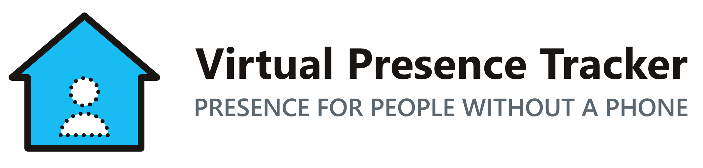
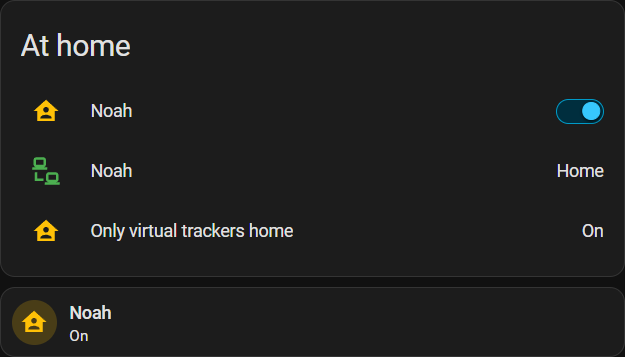
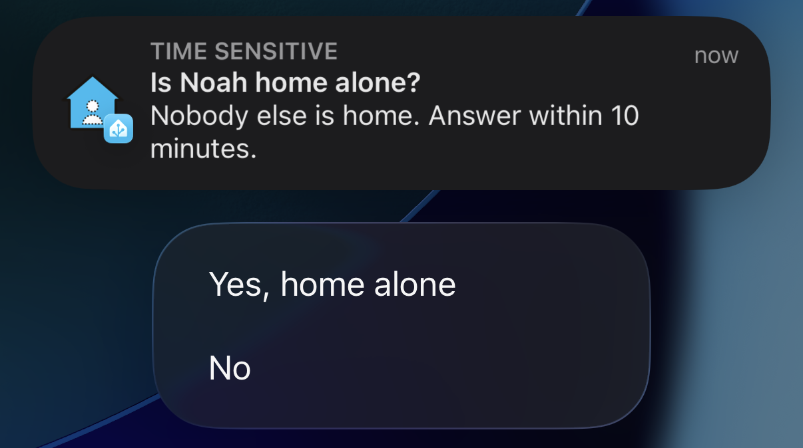
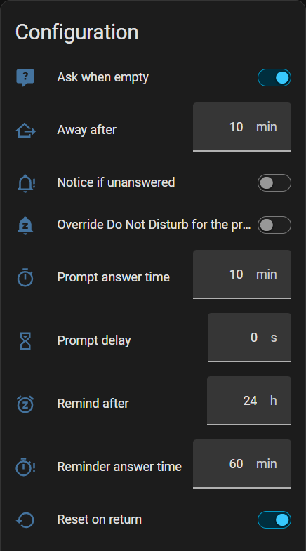
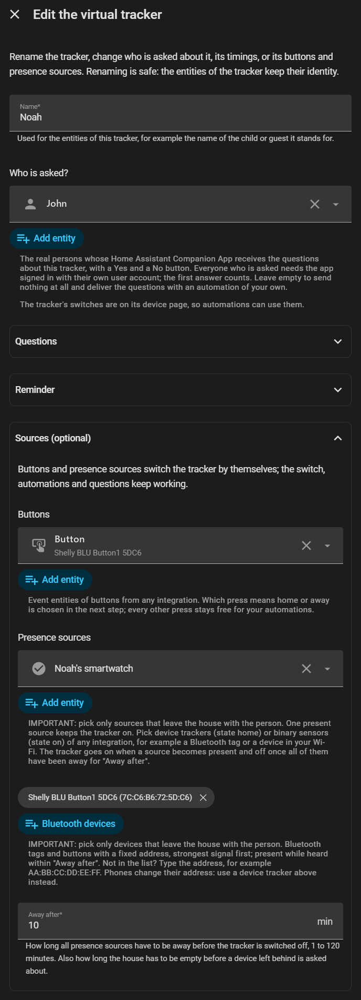
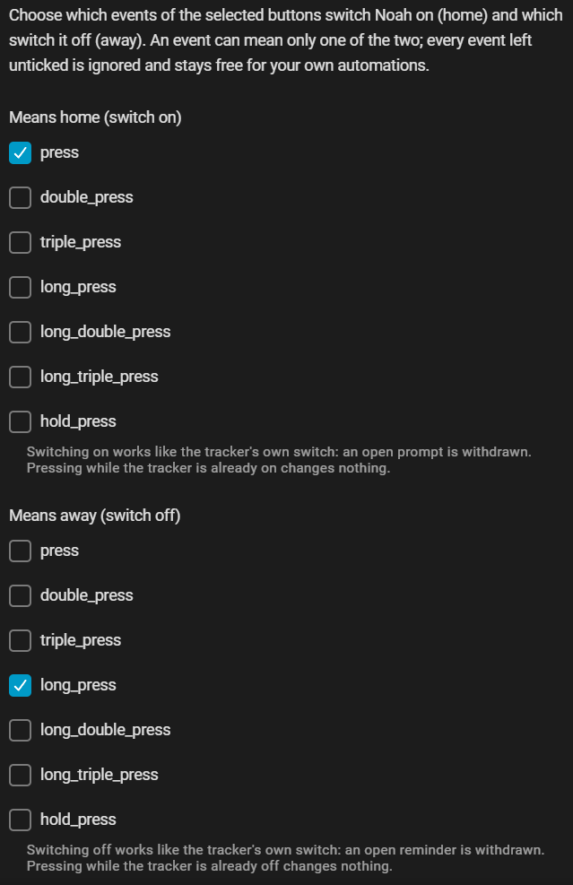

<div align="center">

<picture>
  <source media="(prefers-color-scheme: dark)" srcset="custom_components/virtual_presence_tracker/brand/dark_logo@2x.png">
  
</picture>

**Somebody is at home but Home Assistant thinks the house is empty? Tell it. For a
child without a phone, grandparents, a babysitter, or any guest.**

[![Release][release-badge]][release-url] &nbsp; [![HACS][hacs-badge]][hacs-url] &nbsp; [![Validate][validate-badge]][validate-url] &nbsp; [![Tests][tests-badge]][tests-url]

</div>

A Home Assistant custom integration for people who are at home without a
tracked phone. For each of them you create a **virtual tracker**, and you set
it yourself: by hand, from an automation, or by answering a question on your
phone. It has no detection of its own; if you want, a tracker can also follow a
button or a presence source you already have in Home Assistant.

It does not simulate presence in an empty house; it is for people who really
are at home.

## How it works

Home Assistant decides who is at home from your **real persons**: the people it
already locates with a device tracker of their own, usually a phone. When the
last of them leaves, the house counts as empty.

A virtual tracker is a switch: on means "Kid is at home". While it is on, it
behaves like a device tracker: `person.kid` is `home`, `zone.home` counts them,
and your "nobody home" routines stay quiet. It can be switched in several ways,
and they can be combined:

- **By hand or by an automation**: from a dashboard, an NFC tag or a wall
  switch. See [Use the switch](#5-use-the-switch).
- **By answering your phone**: when the last real person leaves, your phone
  asks "Is Kid home alone?", and **Yes** switches the tracker on. See
  [The prompt](#the-prompt).
- **By a button** you already have in Home Assistant, for example a Shelly BLU
  button: one press for home, a long press for away. See [Buttons](#buttons).
- **By a presence source** you already have in Home Assistant (optional):
  - a **Wi-Fi device** that goes with the person, such as a smartwatch that is
    always on their wrist, through the device tracker of your router's
    integration;
  - a **Bluetooth tag**, such as a key finder in the school bag, picked
    directly from the Bluetooth devices Home Assistant receives;
  - any other device tracker or binary sensor.

  The tracker goes on when a source changes to present and off once all of
  them have been away for a while. Pick sources that leave the house with the
  person; see [Presence sources](#presence-sources).

Three things look after a tracker that is on:

- When the first real person comes back to the empty house, it switches itself
  off if **Reset on return** is on (the default) and it has no presence
  sources. See [Rules at a glance](#rules-at-a-glance).
- If it stays on for a long time (24 hours by default), you get a reminder
  asking whether Kid is still home. See [The reminder](#the-reminder).
- If a presence source keeps it on after everybody has left, you can be asked
  whether Kid is really home (off by default). See
  [A device left behind](#a-device-left-behind).

## Who it is for

A tracker has a free-form name and no built-in role. Create one per person, or
one shared tracker for a group ("Guests").

| Somebody who… | A setup that fits |
|---|---|
| **A child** with no phone, home alone after school | The defaults. Your phone asks when the last of you leaves; the tracker switches off when the first of you is back. A switch on an NFC tag by the door works too. |
| **A babysitter** for an evening | Switch the tracker on before you go, or answer **Yes** when your phone asks. It switches off when you are back; if the sitter leaves earlier, switch it off yourself. |
| **Grandparents** or **guests** for several days | Turn **Reset on return** off, so the tracker stays on when you come home during the visit. In the tracker's form, set **Remind after** to about the length of the stay (48 hours, say), so you are asked instead of finding out a week later. |
| **A carer, a cleaner, a house sitter** | Keep **Ask when empty** on: whenever the last of you leaves, you are asked whether they are still in the house. |

Nothing has to be installed on the other person's side.

## What it does not do

- It delivers the questions only to the Home Assistant Companion App. Any other
  channel is an automation of your own; see
  [docs/AUTOMATIONS.md](docs/AUTOMATIONS.md).
- It does not switch a tracker off because nobody answered, with one
  exception you have to turn on yourself:
  [A device left behind](#a-device-left-behind). The reminder only asks;
  switching off stays your decision.
- It detects nothing by itself. A tracker only knows what you, an automation or
  a source you linked to it tells it.

## Requirements

- Home Assistant **2026.6.0** or newer (the trackers are built on
  `BaseScannerEntity`, which first shipped with that release).
- At least one real person with a device tracker of their own.
- For the question on the phone: the Home Assistant Companion App on the phones
  of the people who are asked, signed in with **that person's own user
  account**. Any app version delivers the question; showing the integration's
  icon in place of the app icon needs the **iOS Companion App 2026.8.0** or
  newer.
- Only for Bluetooth devices as a presence source: Home Assistant's Bluetooth
  integration, with a local adapter or a Bluetooth proxy.

**Tested with** the iOS Companion App on an iPhone and the Android Companion App
on a tablet.

## Installation

### HACS (recommended)

[](https://my.home-assistant.io/redirect/hacs_repository/?owner=dabo53ck&repository=virtual-presence-tracker-ha&category=integration)

1. Click the button above (or open HACS → **⋮** menu, top right → **Custom
   repositories**, and add
   `https://github.com/dabo53ck/virtual-presence-tracker-ha` with the type
   **Integration**).
2. Install **Virtual Presence Tracker** and restart Home Assistant.

### Manual

1. Copy the folder `custom_components/virtual_presence_tracker` into the
   `custom_components` folder of your Home Assistant configuration.
2. Restart Home Assistant.

## Setup

### 1. Add the integration

[](https://my.home-assistant.io/redirect/config_flow_start/?domain=virtual_presence_tracker)

If the button doesn't work: **Settings → Devices & services → Add integration
→ Virtual Presence Tracker.**

You are asked for your **real persons**. They decide when the house is empty,
so each of them needs a device tracker of their own; the persons that currently
have one are suggested. At least one person is required.

You can change them later with **Reconfigure** on the integration's page.

Do **not** pick the person a virtual tracker belongs to: switching that tracker
on would look like a real arrival and switch every tracker off. **Reconfigure**
refuses such a person, and a repair issue reports it if it happens otherwise.

### 2. Add a virtual tracker

The form for your first tracker opens by itself. It asks for three things:

- **Name**: the child, grandparent or guest the tracker stands for.
- **Who is asked?**: the real persons whose phones get the questions about this
  tracker. For a new tracker all of them are ticked. Their phone is found
  through the user linked to their person under **Settings → People**. Leave
  it empty to send nothing and handle the questions with an automation of
  your own.
- **Create a person for this tracker** (ticked): creates a person without a
  login, named like the tracker, and assigns the tracker's device tracker to
  it. That person is what counts as being at home. The integration never
  changes a person you already have, never creates a second person of the same
  name, and never deletes one, not even together with its tracker.

If you unticked the box, or a person of that name already exists (then none is
created): open that person under **Settings → People** (or add one, no login
needed), pick `device_tracker.kid` in its list of device trackers, and save.
Until then a repair issue reminds you.

Below them are three sections, closed until you open them: **Questions**,
**Reminder** and **Sources (optional)**; **Sources** opens by itself for a
tracker that already has sources. Their defaults fit most households (see
[Settings](#settings)). Leave **Sources** empty for a tracker you switch
yourself (see
[Optional: buttons and presence sources](#optional-buttons-and-presence-sources)).

If you close the form without adding a tracker, a repair issue reminds you. You
add the first and every further tracker under **Settings → Devices & services →
Integrations → Virtual Presence Tracker → Add virtual tracker**. **Edit virtual
tracker** on the same page changes the name, **Who is asked?**, the timings, the
buttons and the presence sources later. To remove a tracker, choose **Delete**
in its **⋮** menu on that page; its person stays.

### 3. The entities you get

For a tracker named *Kid*:

| Entity | What it is for |
|---|---|
| `switch.kid_at_home` | The control. On means "Kid is at home". |
| `device_tracker.kid` | Follows the switch (`home` / `not_home`). Assigned to Kid's person. |
| `event.kid_questions` | Announces the prompt, the reminder and the question about a device left behind (see below). |

Next to them sit five settings switches; see [Settings](#settings).

Entity IDs are built from the tracker's name and the entity names in the
**language of your Home Assistant**. This README uses English; on a German
instance the same entities are `switch.kid_zu_hause` and `event.kid_fragen`.
Look yours up under **Settings → Devices & services → Entities**.

### 4. Try it right away

You do not have to leave the house to see the question on your phone:

1. **Developer tools → Actions**.
2. Pick **Virtual Presence Tracker: Open prompt** (the tracker has to be off)
   or **Virtual Presence Tracker: Open reminder** (the tracker has to be on).
   With a presence source, **Virtual Presence Tracker: Ask about device left
   behind** works the same way (the tracker has to be on).
3. Choose the tracker's switch (`switch.kid_at_home`) as the target and press
   **Perform action**.

The question goes to everybody under **Who is asked?** and then behaves as
after a real departure: answer it on the phone, switch the tracker yourself, or
let the time run out. While you are testing, set **Answer time** under
**Questions** or **Reminder** in the tracker's form to one minute.

### 5. Use the switch

Put the switch on a dashboard (see [Everyday use](#everyday-use)), on an NFC
tag at the front door or on a wall button, or let an automation flip it. It
keeps its state over a restart of Home Assistant.

## Everyday use

Put `switch.kid_at_home`, `device_tracker.kid` and the household sensor on an
entities card, or the switch alone on a tile card:



### The "Only virtual trackers home" sensor

One binary sensor for the household, `binary_sensor.only_virtual_trackers_home`
on an English instance: on when at least one virtual tracker is at home and
none of your real persons is. Use it to make a routine behave differently when
the only people at home are ones without a tracked phone. It has no device;
find it under **Settings → Devices & services → Entities**.

Its attributes are `real_persons_home` (how many real persons are at home) and
`virtual_trackers_home` (the names of the trackers that are on). Right after a
restart it is `unknown` until the state of a real person is known; treat
`unknown` as "do nothing".

```yaml
triggers:
  - trigger: state
    entity_id: binary_sensor.only_virtual_trackers_home
    from: "off"
    to: "on"
actions:
  - action: notify.mobile_app_<your_phone>
    data:
      message: Only virtual trackers are at home now.
```

## The questions on the phone

There are three: the prompt, the reminder and, for a tracker with presence
sources, the question about [a device left behind](#a-device-left-behind).

### The prompt

When the last real person leaves and a tracker is off, the people under **Who is
asked?** get a question on their phones:



**Yes** switches the tracker on. **No** or no answer changes nothing: the house
keeps counting as empty. There is never a default answer. The first answer
counts, and the message disappears from every phone that was asked; it also
disappears when somebody comes home, when the tracker is switched on and when
the time runs out.

A tracker that is already on does not ask, so you can also switch it on before
you leave.

### The reminder

A tracker that somebody forgets to switch off keeps the house counting as
occupied: the alarm does not arm, the vacuum does not run. Once a tracker has
been on for **Remind after** hours, the same people are asked "Is Kid still
home?":

- **Yes, still home** changes nothing and starts the waiting time again.
- **No, switch off** switches the tracker off.
- **No answer** changes nothing either: the tracker stays on, and you are asked
  again after another interval. Nothing is switched off by itself.

**0 means never**; a new tracker starts at 24 hours. The reminder has its own
**Answer time** in the **Reminder** section of the form (60 minutes by default,
against the prompt's 10), because a reminder is often answered much later than
a prompt.

### About the messages

- **Notice if unanswered** (off by default) replaces an expired question with
  a short note, such as "No answer: Kid counts as not at home."
- The messages about one tracker are grouped on the phone ("Virtual presence:
  Kid" on Android) and carry the integration's icon (see
  [Requirements](#requirements)).
- They follow the language of your Home Assistant (English, German, French or
  Spanish; any other gets English).
- A person with two phones is asked on both. If Home Assistant has no phone for
  somebody under **Who is asked?**, a repair issue says so, as long as the
  tracker asks at all.

### When the phone is on silent

A phone on silent, on Do Not Disturb or in a Focus mode may show the prompt
without a sound, and an unnoticed prompt leaves the house counting as empty.
With **Override Do Not Disturb for the prompt** on, the prompt is sent:

- on **iOS** as a *critical alert*, which ignores the mute switch and Do Not
  Disturb. This also needs the **Critical Alerts** switch in the notification
  settings of the Home Assistant app; without it the prompt arrives as a normal
  notification.
- on **Android** on the `alarm_stream` channel, the exception Do Not Disturb
  keeps for alarms.

It is loud, at night and in meetings too, so it is **off by default**. It
applies to the prompt only; the reminder and the notes about unanswered
questions stay quiet. The question about a device left behind has a switch of
its own, **Override Do Not Disturb for a device left behind**, also off by
default.

### Other channels

Every question is announced by the tracker's event entity and can be
answered with an action, so a speaker, Telegram or a dashboard button can carry
the question instead of the phone, or alongside it. See
[docs/AUTOMATIONS.md](docs/AUTOMATIONS.md).

## Settings

A tracker's settings are split in two. What you may want to change depending on
the situation is a switch on the tracker's device page; what you set once is in
the tracker's form.

### On the device page

**Settings → Devices & services → Virtual Presence Tracker → Kid**, under
**Configuration**, out of the way of everyday use. They can be used in
automations like any other switch, and a change takes effect without a reload.



| Switch | What it does | Default for a new tracker |
|---|---|---|
| **Ask when empty** | Whether the tracker asks at all when the last real person leaves. | on |
| **Reset on return** | Switches the tracker off when the first real person comes back; see [Rules at a glance](#rules-at-a-glance). | on |
| **Override Do Not Disturb for the prompt** | Lets the prompt through a silenced phone; see [When the phone is on silent](#when-the-phone-is-on-silent). | off |
| **Ask about a device left behind** | Only for a tracker with presence sources; see [A device left behind](#a-device-left-behind). | off |
| **Override Do Not Disturb for a device left behind** | Lets that question through a silenced phone, like the prompt's switch. | off |

### In the form

**Edit virtual tracker** on the integration's page. Saving a change of these
values also takes effect without a reload.



| Section | Field | What it does | Default for a new tracker |
|---|---|---|---|
| Questions | **Answer time** | How long a prompt stays open, 1 to 120 minutes. Also the answer time of the question about a device left behind. | 10 |
| Questions | **Delay** | How long to wait after the last departure before asking, 0 to 600 seconds. | 0 |
| Questions | **Notice if unanswered** | Sends a short note when a question expires. | off |
| Reminder | **Remind after** | After how many hours on the tracker asks whether the person is still there, 0 to 168 hours. 0 means never. | 24 |
| Reminder | **Answer time** | How long a reminder stays open, 1 to 360 minutes. | 60 |
| Sources | **Away after** | Only for a tracker with presence sources: how long all of them have to report "away" before it switches off, 1 to 120 minutes. Also how long the house has to be empty before a device left behind is asked about. | 10 |

**Sources** also holds the buttons and the presence sources; see
[Optional: buttons and presence sources](#optional-buttons-and-presence-sources).

A tracker from an older version that never stored a value behaves as it did:
**Ask when empty** off and **Remind after** 0. Before 0.1.0 the six values in
the form were entities on the device page; see the
[release notes](https://github.com/dabo53ck/virtual-presence-tracker-ha/releases).

### Rules at a glance

- **Reset on return** switches a tracker off when the number of real persons
  at home goes from **0 to 1**. Nothing happens when a second person arrives,
  when people leave, or right after a restart (a person whose state was not
  known before does not count as arriving). A tracker with **presence
  sources** is never reset this way; its sources decide. A tracker with
  buttons only resets as usual.
- A tracker asks only when the last real person leaves and it is off. Switching
  **Ask when empty** off withdraws a waiting or open prompt, from the phones as
  well (not one you opened with **Open prompt**).
- The prompt does not hold back your own "nobody home" automations; see
  [How the timing works](docs/AUTOMATIONS.md#how-the-timing-works).

## Optional: buttons and presence sources

A tracker needs none of this and works as described above without it. Buttons
and presence sources only add more ways to switch it; the switch, your
automations and the questions keep working. Both are picked in the
**Sources** section of the tracker's form (**Add virtual tracker** or **Edit
virtual tracker**), shown under [In the form](#in-the-form). Examples are in
[How it works](#how-it-works).

### Buttons

A button can be any `event` entity, from any integration. After you pick one,
the step **Button events** asks which of its event types mean home and which
mean away; for a button that offers `press` it suggests `press` and
`long_press`. Every other event type is ignored and stays free for your own
automations.



### Presence sources

The tracker counts as present while any of its sources is:

- a **device tracker** while it is `home`, for example a smartwatch in your
  Wi-Fi through your router's integration, or a Bluetooth tag through an
  integration such as iBeacon Tracker, Private BLE Device or Bermuda;
- a **binary sensor** while it is `on`;
- a **Bluetooth device**, picked by its fixed address from the devices Home
  Assistant receives, while it has been heard within **Away after**. The field
  only appears when Home Assistant's Bluetooth integration is set up, and it
  lists the devices heard right now; type the address of one that is out of
  range. Phones and other devices that keep changing their address cannot be
  followed this way; use the device tracker of their own integration instead.

> [!IMPORTANT]
> **Pick only sources that leave the house with the person.** One present
> source is enough to keep the tracker on. A tablet left at home keeps it on
> while everybody is out, even if the Bluetooth tag went along, and the house
> keeps counting as occupied. Several sources only help if each of them goes
> where the person goes.

The tracker switches on when its sources become present and off once all of
them have been away for **Away after**. A change by hand in between stays until
the next such change, and `unknown` or `unavailable` never counts as away. A
Bluetooth tag in range only means it is near one of Home Assistant's Bluetooth
adapters or proxies, which may include the garden or the flat next door.

If a source is present when the last real person leaves, the tracker switches
on instead of asking, also with **Ask when empty** off, but not while its
sources are being ignored after [a device left behind](#a-device-left-behind).

Timing, polling and what a restart does are in
[docs/AUTOMATIONS.md](docs/AUTOMATIONS.md#buttons-and-presence-sources).

### A device left behind

If a source stays at home anyway, such as a tablet on the sofa, the tracker
stays on while everybody is out. With **Ask about a device left behind** on
(off by default), the people under **Who is asked?** get one question **Away
after** minutes after the last real person left, if a source still reports
present then:


**Yes, home** changes nothing. **No, switch off** and **no answer** both switch
the tracker off, the one exception to "no answer changes nothing"; the device is
then ignored until it has been away for **Away after**. The switch and buttons
always work. Timing, the lock on the sources and restarts:
[docs/AUTOMATIONS.md](docs/AUTOMATIONS.md#the-device-left-behind-actions).

## Troubleshooting

The integration reports what it cannot fix by itself under **Settings → Devices
& services → Repairs**. Every issue disappears on its own once its cause is
gone.

| Repair issue | Cause and fix |
|---|---|
| **No virtual tracker has been added yet** | Add one with **Add virtual tracker**. |
| **The virtual tracker … is not assigned to a person** | No person has its device tracker; pick it for one in **Settings → People**. |
| **The real person … has a virtual tracker attached** | Remove the tracker from that person, or the person from the real persons. |
| **… has no phone to be asked on** | Sign in to the Companion App with their own user, or remove them from **Who is asked?**. |
| **The real person … no longer exists** | Pick your real persons again with **Reconfigure**. |

## FAQ

**Does the other person have to install anything?**
No. Nothing runs on their side.

**Can a person have both a virtual tracker and a real one?**
Yes. The virtual tracker reports as a `router`-type tracker (home or away, no
coordinates), and Home Assistant prefers such a tracker that is `home` over GPS:
while the virtual tracker is on it wins, while it is off the other tracker
decides.

**Can I have more than one household?**
No. There is one configuration per Home Assistant instance, with any number of
trackers in it.

**Does renaming a tracker break my automations?**
No. Entity IDs and unique IDs do not change when you rename a tracker; only the
displayed name does.

## Help, translations and license

Questions and bug reports:
[GitHub issues](https://github.com/dabo53ck/virtual-presence-tracker-ha/issues).
To add a language, see [CONTRIBUTING.md](CONTRIBUTING.md).

License: [MIT](LICENSE)

[release-badge]: https://img.shields.io/github/v/release/dabo53ck/virtual-presence-tracker-ha?include_prereleases&label=release
[release-url]: https://github.com/dabo53ck/virtual-presence-tracker-ha/releases
[hacs-badge]: https://img.shields.io/badge/HACS-Custom-41BDF5.svg
[hacs-url]: https://github.com/hacs/integration
[validate-badge]: https://github.com/dabo53ck/virtual-presence-tracker-ha/actions/workflows/validate.yml/badge.svg
[validate-url]: https://github.com/dabo53ck/virtual-presence-tracker-ha/actions/workflows/validate.yml
[tests-badge]: https://github.com/dabo53ck/virtual-presence-tracker-ha/actions/workflows/tests.yml/badge.svg
[tests-url]: https://github.com/dabo53ck/virtual-presence-tracker-ha/actions/workflows/tests.yml
